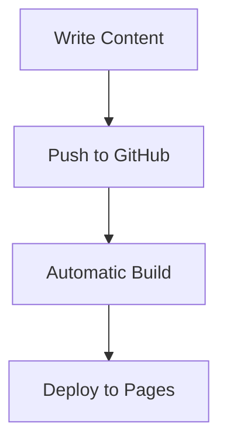

# GitHub Integration Setup Guide

This guide explains how to set up the two-repository GitHub integration for your blog system.

## Architecture Overview

The blog uses a **two-repository architecture**:

1. **Blog Code Repository** (this repo): Contains the Astro site code, components, and build configuration
2. **Content Repository**: Contains markdown posts, assets, and content configuration

When you push content to the content repository, it automatically triggers a rebuild and deployment of the blog.

## Setup Instructions

### 1. Create Content Repository

Create a new GitHub repository for your blog content with the following structure:

```
blog-content/
├── posts/
│   ├── my-first-post.md
│   ├── getting-started-with-astro.md
│   └── advanced-markdown-features.md
├── assets/
│   └── images/
│       └── hero-image.jpg
└── README.md
```

### 2. Configure Environment Variables

Copy `.env.sample` to `.env` and fill in your GitHub details:

```bash
cp .env.sample .env
```

Update the following variables in `.env`:

```bash
# GitHub API integration for blog content
GITHUB_TOKEN=your_github_personal_access_token
CONTENT_REPO_OWNER=your_username
CONTENT_REPO_NAME=blog-content
```

### 3. Create GitHub Personal Access Token

1. Go to GitHub Settings → Developer settings → Personal access tokens
2. Click "Generate new token (classic)"
3. Give it a descriptive name like "Blog Content Access"
4. Select the following scopes:
   - `repo` (Full control of private repositories)
   - `public_repo` (Access public repositories)
5. Copy the generated token and add it to your `.env` file

### 4. Content Repository Secrets

Add the following secrets to your **blog repository** (this repo):

1. Go to Settings → Secrets and variables → Actions
2. Add these repository secrets:
   - `CONTENT_GITHUB_TOKEN`: Your GitHub personal access token
   - `CONTENT_REPO_OWNER`: Your GitHub username
   - `CONTENT_REPO_NAME`: Name of your content repository (e.g., "blog-content")

### 5. Enable GitHub Pages

1. Go to your blog repository Settings → Pages
2. Set Source to "GitHub Actions"
3. The blog will be available at `https://your-username.github.io/your-repo-name`

### 6. Set Up Webhooks (Optional)

To enable automatic rebuilds when content changes:

```bash
# Set up environment variables for webhook creation
export BLOG_REPO_OWNER=your_username
export BLOG_REPO_NAME=your-blog-repo-name

# Run the webhook setup script
node scripts/setup-webhook.js
```

## Content Format

### Blog Post Structure

Each blog post should be a markdown file in the `posts/` directory with frontmatter:

```markdown
---
title: "Your Post Title"
description: "A brief description of your post"
date: 2025-01-16
tags: ["astro", "blog", "tutorial"]
draft: false
author: "Your Name"
heroImage: "/assets/images/hero.jpg"
---

# Your Post Content

Write your blog post content here using standard markdown.

## Features Supported

- **Bold text** and *italic text*
- `Inline code` and code blocks
- Links and images
- Lists and tables
- Mermaid diagrams
- Syntax highlighting



## Development Workflow

### Local Development

```bash
# Install dependencies
yarn install

# Start development server
yarn dev

# Build for production
yarn build

# Preview production build
yarn preview
```

### Content Management

1. **Local Content**: Add files to `src/content/blog/` for local development
2. **GitHub Content**: Push markdown files to your content repository's `posts/` directory
3. **Priority**: Local content takes precedence over GitHub content for the same slug

### Deployment

The blog automatically deploys when:
- You push changes to the blog code repository
- Content is updated in the content repository (if webhooks are set up)
- You manually trigger the deployment workflow

## Troubleshooting

### Build Errors

If the build fails due to missing GitHub credentials:
1. Check that all required secrets are set in your repository
2. Verify your GitHub token has the correct permissions
3. The build will fall back to local content if GitHub integration fails

### Content Not Updating

1. Check the Actions tab for failed deployments
2. Verify webhook configuration in your content repository
3. Manually trigger a deployment from the Actions tab

### Local Development Issues

If GitHub integration isn't working locally:
1. Check your `.env` file configuration
2. Verify your GitHub token is valid
3. The blog will work with local content only

## Advanced Configuration

### Custom Domain

To use a custom domain:
1. Add a `CNAME` file to the `public/` directory with your domain
2. Configure DNS records with your domain provider
3. Update the `site` URL in `astro.config.mjs`

### Content Caching

The system automatically caches GitHub API responses during builds. To clear the cache:
1. Manually trigger a new deployment
2. Update your GitHub token if needed

### Multiple Content Sources

You can extend the system to support multiple content repositories by:
1. Modifying the `ContentManager` class
2. Adding additional environment variables
3. Updating the webhook configuration

## Security Considerations

- Keep your GitHub token secure and rotate it regularly
- Use repository secrets for sensitive configuration
- The blog fetches content at build time, not runtime, for security
- Content is validated and sanitized during the build process

## Need Help?

- Check the GitHub Actions logs for deployment issues
- Review the console output during development
- Ensure all environment variables are correctly configured
- Verify GitHub API rate limits aren't being exceeded