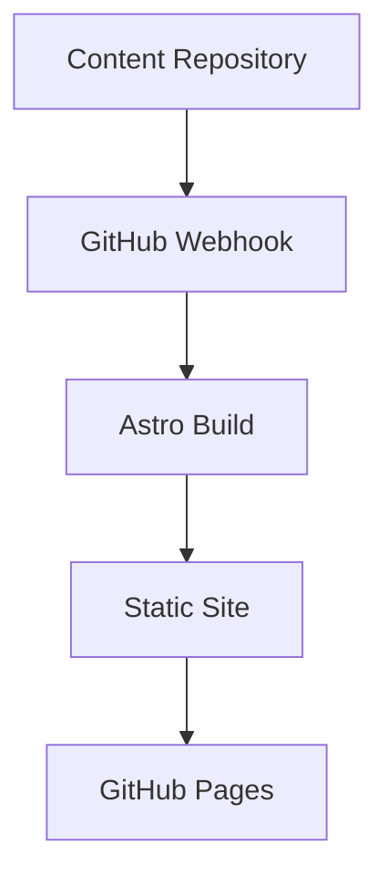

This is the inaugural post on my new blog system! This blog is built with:

- **Astro** for static site generation
- **GitHub integration** for content management
- **Tailwind CSS** for styling
- **Advanced markdown** with Mermaid diagram support

## Features

The blog supports advanced markdown features including:

### Code Highlighting

```javascript
function greet(name) {
  console.log(`Hello, ${name}!`);
}

greet('World');
```

### Mermaid Diagrams



### Typography

The blog uses a modern typography system with **bold text**, *italic text*, and `inline code`.

Looking forward to sharing more content here!