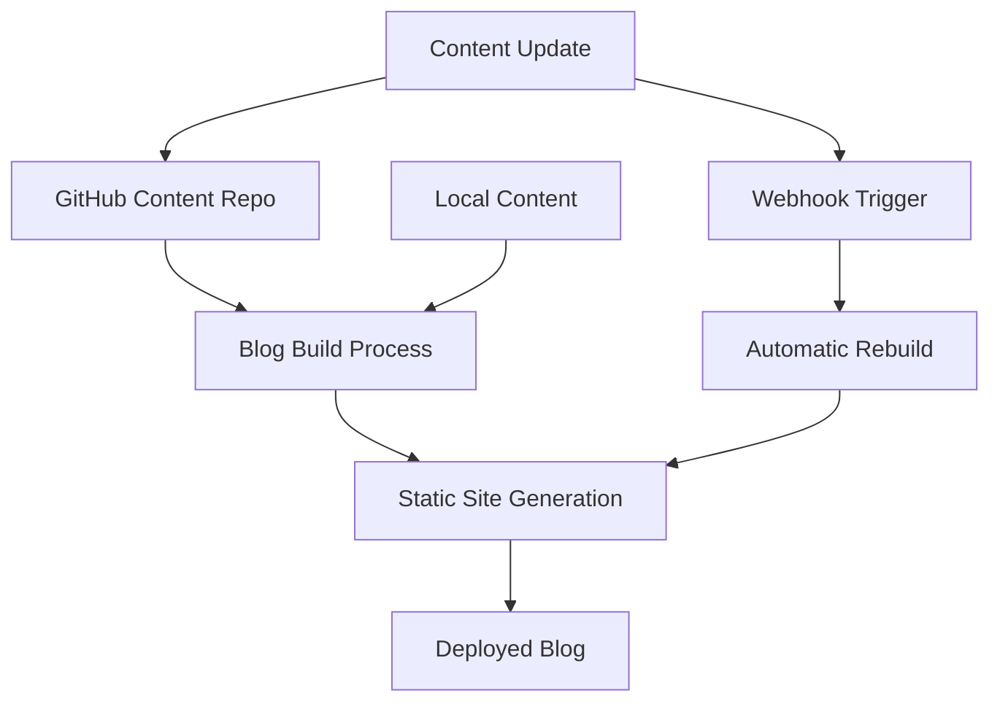

# Hello from GitHub!

This post is being fetched automatically from my GitHub content repository!

## Features

- Automatic content sync
- Markdown with frontmatter
- Build-time fetching for performance
- Graceful fallback to local content

## Technical Details

The blog system:
1. **Fetches content** from GitHub API during build
2. **Combines** GitHub content with local content
3. **Prioritizes** local content over GitHub content for same slugs
4. **Handles errors** gracefully with fallback to local content

## Code Example

```javascript
const contentManager = new ContentManager();
const allPosts = await contentManager.getAllPosts();
console.log(`Loaded ${allPosts.length} posts from multiple sources!`);
```

## Mermaid Diagram



Pretty cool! 🚀